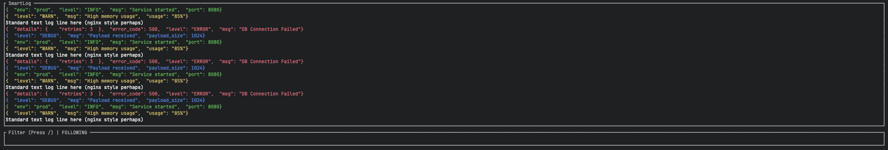

# SmartLog 🚀

[](https://opensource.org/licenses/MIT)
[](https://www.rust-lang.org/)

A blazing-fast terminal UI (TUI) for tailing and filtering log files in real-time. SmartLog automatically detects JSON logs, pretty-prints them, syntax highlights by log level, and provides powerful filtering capabilities—all within an elegant, responsive terminal interface.

Perfect for developers, DevOps engineers, and anyone who works with application logs daily.



## ✨ Features

- 🎨 **Automatic JSON Detection & Pretty-Printing** - Detects JSON log entries and formats them beautifully
- 🌈 **Syntax Highlighting** - Color-coded by log level (ERROR, WARN, INFO, DEBUG)
- 🔍 **Real-Time Filtering** - Filter logs as they stream with instant search
- 🔄 **Auto-Follow Mode** - Automatically scrolls to show newest logs (like `tail -f`)
- ⚡ **High Performance** - Built in Rust with async I/O for minimal resource usage
- 📜 **Scroll History** - Navigate through up to 2,000 recent log entries
- 🎯 **Search Highlighting** - Matched search terms are highlighted with a distinct background
- 🖥️ **Cross-Platform** - Works on macOS (Intel & Apple Silicon) and Linux

## 📦 Installation

### macOS

#### Homebrew (Recommended)

```bash
brew tap felipemorandini/smartlog
brew install smartlog
```

#### Direct Download

Download the latest release for your architecture:

**Apple Silicon (M1/M2/M3):**
```bash
curl -LO https://github.com/felipemorandini/smartlog/releases/latest/download/smartlog-macos-silicon
chmod +x smartlog-macos-silicon
sudo mv smartlog-macos-silicon /usr/local/bin/smartlog
```

**Intel:**
```bash
curl -LO https://github.com/felipemorandini/smartlog/releases/latest/download/smartlog-macos-intel
chmod +x smartlog-macos-intel
sudo mv smartlog-macos-intel /usr/local/bin/smartlog
```

### Linux

#### APT (Debian/Ubuntu)

```bash
# Add repository (coming soon)
sudo add-apt-repository ppa:felipemorandini/smartlog
sudo apt update
sudo apt install smartlog
```

#### Direct Download

```bash
curl -LO https://github.com/felipemorandini/smartlog/releases/latest/download/smartlog-linux-amd64
chmod +x smartlog-linux-amd64
sudo mv smartlog-linux-amd64 /usr/local/bin/smartlog
```

### From Source

Requires [Rust](https://www.rust-lang.org/tools/install) 1.70 or later:

```bash
git clone https://github.com/felipemorandini/smartlog.git
cd smartlog
cargo install --path .
```

## 🚀 Usage

### Basic Usage

Start SmartLog with a demo log stream:

```bash
smartlog
```

Tail a specific log file:

```bash
smartlog --file /var/log/myapp.log
```

Or pipe logs directly:

```bash
tail -f /var/log/app.log | smartlog
```

### Keyboard Shortcuts

| Key | Action |
|-----|--------|
| `/` | Enter filter mode |
| `ESC` | Exit filter mode / Clear filter / Re-enable auto-scroll |
| `↑` or `k` | Scroll up (pauses auto-scroll) |
| `↓` or `j` | Scroll down |
| `q` | Quit application |

### Filter Mode

1. Press `/` to enter filter mode
2. Type your search query (case-insensitive)
3. Press `Enter` to apply filter and return to normal mode
4. Press `ESC` to clear the filter and return to normal mode

Matching text is highlighted with a cyan background for easy visibility.

## 📊 Log Format Support

SmartLog intelligently handles various log formats:

### JSON Logs

Automatically detects and pretty-prints JSON with level detection:

```json
{"level": "ERROR", "msg": "Database connection failed", "error_code": 500}
```

Supported level fields: `level`, `severity`, `lvl`

Supported level values:
- **ERROR** / **ERR** / **FATAL** → Red
- **WARN** / **WARNING** → Yellow  
- **INFO** / **INFORMATION** → Green
- **DEBUG** / **TRACE** → Blue

### Plain Text Logs

For non-JSON logs, SmartLog scans for keywords:

```
2024-12-13 10:30:45 ERROR Database connection timeout
```

Keywords: `error`, `warn`, `info` (case-insensitive)

## 🏗️ Architecture

SmartLog is built with modern Rust async patterns:

- **Tokio** - Async runtime for non-blocking I/O
- **Ratatui** - Terminal UI framework
- **Crossterm** - Cross-platform terminal manipulation
- **Serde JSON** - Fast JSON parsing and pretty-printing

## 🤝 Contributing

Contributions are welcome! Please feel free to submit a Pull Request.

1. Fork the repository
2. Create your feature branch (`git checkout -b feature/amazing-feature`)
3. Commit your changes (`git commit -m 'Add some amazing feature'`)
4. Push to the branch (`git push origin feature/amazing-feature`)
5. Open a Pull Request

## 📝 License

This project is licensed under the MIT License - see the [LICENSE](LICENSE) file for details.

## 🐛 Bug Reports & Feature Requests

Found a bug or have a feature request? Please [open an issue](https://github.com/felipemorandini/smartlog/issues/new) on GitHub.

## 👤 Author

**Felipe Pires Morandini**
- GitHub: [@felipemorandini](https://github.com/felipemorandini)
- Email: felipepiresmorandini@gmail.com

## 🙏 Acknowledgments

- Built with [Ratatui](https://github.com/ratatui-org/ratatui) - An amazing TUI framework
- Inspired by tools like `tail`, `less`, and `jq`

---

<div align="center">
Made with ❤️ and Rust 🦀
</div>

